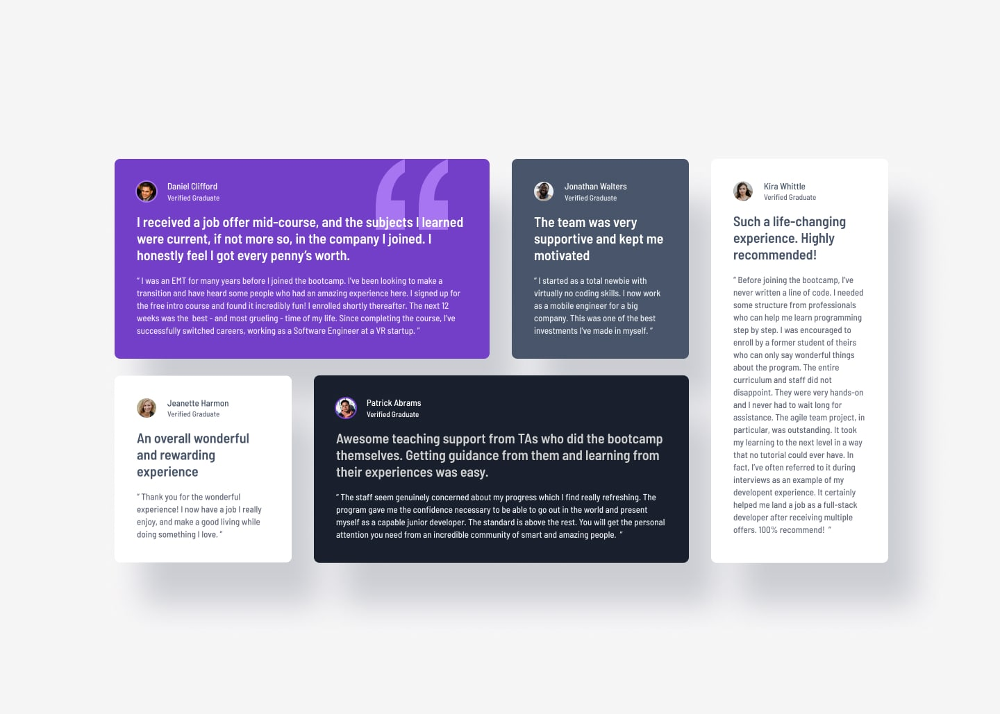

# Frontend Mentor - Testimonials Grid Section

   

## Overview

[Frontend Mentor](https://www.frontendmentor.io) is a great platform to keep studying and practicing front-end development, letting you focus on the code itself without worrying about design or UI. It offers a wide variety of projects, from challenges that only require HTML and CSS to full-stack builds, spanning multiple difficulty levels from newbie to advanced.

This makes it easy to test out whatever you're currently studying — whether that's accessibility, Tailwind, TypeScript, or even React and Next.js — and you can make projects as complete and complex as you like, simulating APIs or databases along the way. It's a great playground to sharpen your skills, adaptable to whatever you need at the time.

### Live Demo

- [Live Demo](https://fuzz-lemon-drift.netlify.app)

## Frontend Mentor

[Frontend Mentor](https://www.frontendmentor.io) challenges help you improve your coding skills by building realistic projects.

The challenges are pretty straight forward, you have to replicate the page or element as closely as possible as the initial image or Figma layout - when provided.

### The Challenge

- [Testimonials Grid Section](https://www.frontendmentor.io/challenges/testimonials-grid-section-Nnw6J7Un7)

Use any tools you like to help you complete the challenge. So if you've got something you'd like to practice, feel free to give it a go.

Your users should be able to:

- View the optimal layout for the section depending on their device's screen size

Want some support on the challenge? [Join the Frontend Mentor community](https://www.frontendmentor.io/community) and ask questions in the **#help** channel.

## Development Notes

I've also decided to build some of the challenges with Tailwind CSS - including this one - since that's new to me. I know it's not the usual way to use Tailwind but it should be a good training.

The most challenging part was the fact that I'm used to think Desktop first and worry about Mobile later but Tailwind is Mobile first, so I had to rewire my brain to think backwards.

All in all, I think it got pretty close to the original design - except the mouse interactions, as I was testing out some Tailwind transitions.

To think I used to hate these HTML and CSS challenges - back then when I first learned programming I just wanted to practice JavasScript - but here I am.

## Built Using

- HTML
- CSS
    - Flexbox
    - Grid
- Tailwind CSS

## Author

[@psudo-dev](https://github.com/psudo-dev)

## License

This project is licensed under the MIT License - see the [LICENSE.md](./LICENSE.md) file for details
